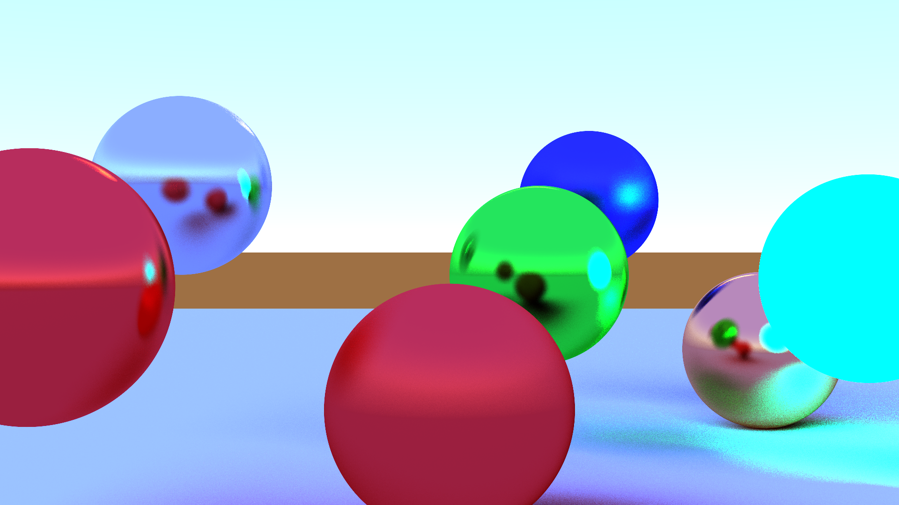

# Ray Tracer
This project is a CPU and GPU ray tracer using the Vulkan API. It is a heavy work-in-progress and lots of features need to be implemented (materials, anything other than spheres being rendered, lights, etc.). The CPU and GPU rendering outputs are not always in sync as things are being added.
## Rendering Example:

## Roadmap:

## Vulkan SDK:
https://www.lunarg.com/vulkan-sdk/
# Installaton
## Required Environment Variables for Visual Studio solution:
VULKAN_SDK - Vulkan SDK installation location

All other dependencies are included as submodules, use "git clone --recursive" to get them

## Compatibility

This has only been built and tested on Windows
