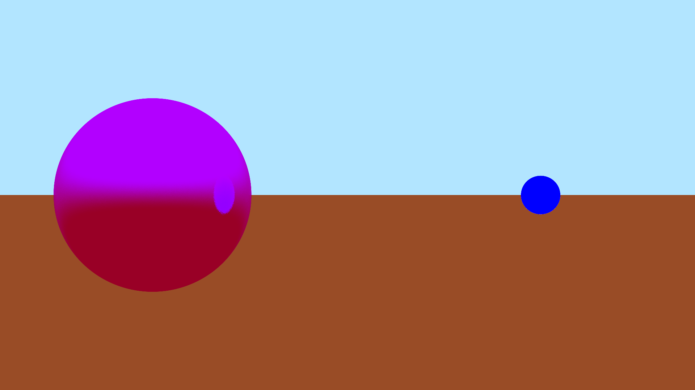

# Ray Tracer
This project is a CPU and GPU ray tracer using the Vulkan API. It is a heavy work-in-progress and lots of features need to be implemented (materials, anything other than spheres being rendered, lights, etc.). The CPU and GPU rendering outputs are not always in sync as things are being added.
## CPU Rendering Example:

## GPU Rendering Example:

# Dependencies:
## LibPNG:
http://www.libpng.org/pub/png/libpng.html
## ZLib:
http://www.zlib.net/
## Vulkan SDK:
https://www.lunarg.com/vulkan-sdk/
# Installaton
## Required Environment Variables for Visual Studio solution:
ZLIB - zlib library source directory

LIBPNG - lpng1637 library source directory 

VULKAN_SDK - Vulkan SDK

## Compatibility

This has only been built and tested on Windows
